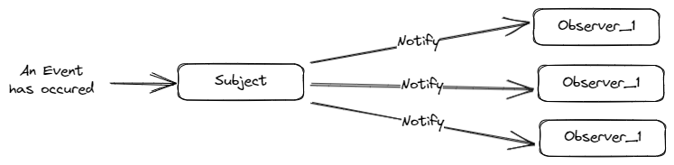

# Design-Patterns-With-java

## 1. Observer Design Pattern.
➜ The pattern overview.  

➜ The problem that observer pattern solved.  
- This patterns is used when we have at least 2 objects and we want to control the behaviour of these objects togeather without coupling them, in another words, we don't need one object depends on another one in order to complete the desired behaviour.

- We use this pattern when we have for example obj_A, obj_B, and obj_C and when specific action happens to obj_A, we need to notify obj_B and obj_C, but we need to do this without forcing obj_A to have obj_B and obj_C as members inside it.

- This pattern also solved the problem of being able to dynamically register and un-register the observers with high-decoubling between objects.